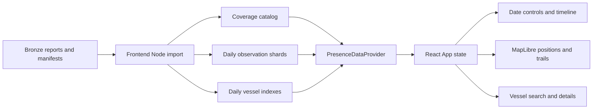

# Vessel presence data flow

This document describes the implemented presence viewer. The browser reads generated static assets; **no backend currently serves presence data**. The risk API in this folder's README is a separate future contract and is not used by this viewer.



## Run and update the viewer

From the repository root:

```bash
cd code/frontend
npm ci
npm run import:presence
npm run dev
```

Open the local URL printed by Vite. The installed Vite package declares `^20.19.0 || >=22.12.0` as its Node requirement; this implementation was checked with Node 23.11.0. No GFW token, Python environment, Silver files, or backend process is required.

After adding a complete `report.json` and sibling `manifest.json` anywhere under `data/bronze/gfw_presence`, rerun `npm run import:presence` and refresh the browser. New dates and vessels are discovered automatically by that command. For a production static build, run `npm run build` after import; `npm run preview` serves the resulting build locally. Browser refresh does not itself rescan Bronze.

The importer is `code/frontend/scripts/export-presence.mjs`. Its input/output defaults are resolved relative to the script, not the shell's working directory. Overrides are available for tests or another local collection:

```bash
npm run import:presence -- --input /absolute/presence-folder --output /absolute/export-folder
npm test
npm run build
```

Generated assets are ignored at `code/frontend/public/data/presence/` and copied into `dist/data/presence/` by Vite. Bronze files are read-only. The only backend-folder change for this feature is this document.

## Import rules and observation meaning

Reports contain `entries: [{ "public-global-presence:v4.0": [rows] }]`. In the current reports `total: 1` counts the dataset envelope, not its thousands of observations. The importer requires matching envelope totals when supplied, `nextOffset: null` or absent, and an initial/null offset. An empty dataset array is valid; an empty envelope object is not.

Each report requires a sibling manifest with `created_at`, `dataset_version`, `row_count`, and a `request` describing an hourly, unaggregated, vessel-grouped report, its region, spatial resolution, and half-open UTC date range. Supported spatial resolutions are HIGH (0.01°) and LOW (0.1°). Embedded paths may contain Windows separators; discovery uses actual sibling files instead.

| Bronze field | Viewer meaning |
| --- | --- |
| `date` | Observation hour, interpreted as UTC even when the string has no suffix |
| `vesselId` | Stable identity, exported as `gfw:<vesselId>` |
| `lat`, `lon` | Recorded GFW grid-cell center, not an exact raw AIS position |
| `hours` | Presence duration within the hour, from 0 to 1 |
| Dataset envelope key | Presence dataset version; the row's `dataset` can instead identify a vessel-identity dataset |
| `shipName`, `mmsi`, `imo`, `callsign`, `flag`, `vesselType` | Nullable source-reported profile fields |

`entryTimestamp`, `exitTimestamp`, and `lastTransmissionDate` do not drive playback. Empty profile fields do not invalidate a vessel with a valid GFW ID. Do not use a vessel name or IMO as a unique key.

The importer validates envelope structure, manifest counts, supported settings, date/calendar/hour validity, request bounds, finite in-range coordinates, vessel IDs, and presence duration. If a manifest supplies `valid_position_count`, it must equal the row count. Supplied `raw_response_sha256` values are checked against canonical content, with a source-token canonicalization fallback preserving Python numeric spelling and ASCII string escapes. They are not raw file-byte hashes. Any validation failure reports the source file and leaves the previous published catalog usable; invalid observations are not silently dropped into apparently empty coverage.

Equivalent parsed payloads reuse parsed envelope rows. Semantic deduplication uses dataset version, grid resolution, GFW ID, UTC hour, and integer grid-cell coordinates (`round(coordinate / resolution)`). This merges floating-point representations such as 158.64 and 158.63999938964844 at HIGH resolution. Distinct cells within one vessel-hour survive; do not replace this key with vessel/hour alone. Original normalized coordinates are preserved in the exported observation.

For overlapping records, precedence is latest manifest creation time, relative source path, observation timestamp, then canonical row hash. This also makes profile selection deterministic when records have equal retrieval times. The exported `metadataRank` carries that ordering into range-wide profile merges. Profile metadata is source-reported and may reflect the retrieval's identity information rather than a historical identity assertion at the cursor.

## Static contracts (schema version 1)

The TypeScript contracts live in `code/frontend/src/presence/types.ts`. The browser adapter lives in `src/presence/provider.mjs`, with its TypeScript declaration beside it. Asset URLs in the catalog are relative to the presence asset root, which respects Vite's base URL.

| Asset | Fields and purpose |
| --- | --- |
| `catalog.json` | `schemaVersion`, content `revision`, `generatedAt`, `source`, `positionSemantics`, regional `coverage[]`, `days[]`, `observationCount`, `coveredHourCount` |
| `coverage[]` | `start`, exclusive `end`, `regionDataset`, `regionId`, `datasetVersion`, `gridResolution` |
| `days[]` | `date`, `observationsUrl`, `vesselsUrl`, circular longitude-aware `bounds` or null, `coveredHours` (0–23), 24-element `hourlyCounts`, `observationCount`, `vesselCount` |
| Daily observations | `{ date, observations: Observation[] }`, ordered by UTC timestamp then stable observation ID |
| `Observation` | `id`, `vesselId`, `ts` (ISO UTC), `lat`, `lon`, `presenceHours`, `datasetVersion`, `gridResolution` |
| Daily vessel index | `{ date, vessels: PresenceVessel[] }`; one profile per observed vessel that day |
| `PresenceVessel` | `id`, nullable `name`/`mmsi`/`imo`/`callsign`/`flag`/`vesselType`, `firstObservedAt`, `lastObservedAt`, `observationCount`, `metadataUpdatedAt`, deterministic `metadataRank` |

The exporter validates every report before publication. Daily assets have content-hashed names; existing immutable assets are not rewritten, new assets are written to temporary files and renamed, and the catalog is atomically replaced last. Existing tabs can continue using their old catalog. Old immutable assets are retained deliberately; archive cleanup must account for open clients and is not part of import.

Coverage comes from successful manifest request intervals, **not** minimum/maximum observed timestamps. It describes the imported regions, not global vessel absence:

- Outside all requested intervals: “No imported data for this hour.”
- Within requested coverage with zero rows: “No vessel positions in imported reports for this hour.”
- Individual selected vessel absent in an otherwise populated hour: “No observation this hour.”

Local validation can establish consistency between a report and its manifest, but cannot independently prove the original API region request for a reused report.

## Frontend ownership and behavior

`src/App.tsx` owns the catalog, date range, hourly cursor, playback speed/status, selected GFW ID, observation bundle, vessel index, and request/error state. `Timeline.tsx` renders controls and coverage; `VesselPanel.tsx` owns search text and incremental list display; `MapPanel.tsx` owns the MapLibre instance and sources. Pure time/geometry/request helpers live in `src/presence/timeline.mjs`.

The initial range is the newest imported UTC day. The cursor starts at its first observed hour, or its first covered hour if empty. The map fits that day's circular bounds once; scrubbing and selection do not reset the camera. An empty latest day leaves the global map available.

Day/Week/Month mean rolling 1/7/30 dates ending on the chosen end date. Both custom dates are inclusive, represented internally as `[start midnight, midnight after end)`. Editing dates pauses playback and clamps the cursor into a valid range. Invalid dates disable playback and suppress observations. Selection persists across hour/range changes; if absent from the selected range, the details panel explains that state.

The slider represents every hour, including uncovered periods. Keyboard arrows scrub one hour. Playback and step buttons use covered hours only, retain covered-but-empty frames, and announce jumps over uncovered time. Speeds are 1, 4, or 12 observation-hours per second; playback starts paused and stops at the range end. Clicking the slider or jumping to a vessel observation pauses playback.

Current markers contain only rows matching the cursor exactly. Selected history spans `[max(range start, cursor - 6 hours), cursor)`. Trail segments connect only consecutive hours having exactly one cell each. Missing or multi-cell hours break the line; no interpolation is displayed. Dateline crossings are split into short segments, including the +180/-180 meridian edge case. Map positions use GPU-rendered GeoJSON layers, not thousands of DOM markers.

The provider exposes:

```ts
getCatalog(signal?: AbortSignal): Promise<PresenceCatalog>
getDay(day: PresenceDay, signal?: AbortSignal): Promise<DayObservations>
getVessels(catalog: PresenceCatalog, range: TimeRange, signal?: AbortSignal): Promise<PresenceVessel[]>
prefetchDay(day: PresenceDay): void
```

Observation loading is bounded to the cursor day and, when a six-hour history crosses midnight, the preceding imported day. Playback prefetches the next covered day within the range. A three-entry LRU caches observation shards; summary indexes have a separate 64-entry cache and fetch concurrency of four. Range-wide search loads daily indexes rather than all positional data. The vessel list initially renders 100 matching entries and offers additional batches.

Abort signals and `createLatestRequest()` prevent old responses or errors from replacing current state. Immutable asset keys prevent a previous day's positions from appearing under a new cursor while loading. Cached day data supports synchronous frame changes within a day. Prefetch failure is silent until a foreground request needs that day; foreground failures expose retry controls. Retry preserves the current range and selection. Catalog failure exposes import instructions; the viewer never substitutes mock observations.

## Data snapshot and checks

Snapshot verified from the repository's presence files on September 5, 2026:

| Period | Unique observations | Distinct vessels | Covered hours |
| --- | ---: | ---: | ---: |
| Jan 1, 2022, 00:00 UTC | 1,975 | 1,975 | 1 |
| Aug 1, 2026, 00:00–23:00 UTC | 31,477 | 1,973 | 24 |

Three reports contain two distinct payloads. Export totals are **33,452 observations and 25 covered hours**; there are 3,340 distinct vessels across the two dates. The August first frame contains 1,184 positions; the last contains 1,280. Do not interpret the years between these dates as continuous imported coverage.

`npm test` runs Node's built-in runner against import, timeline/geometry, and provider tests inside `code/frontend/tests`. Fixtures are generated under ignored `.test-output` directories and cleaned up afterward. The real-data acceptance test reads Bronze without modifying it.

Tests cover deduplication, metadata precedence, invalid/partial input, source integrity, publication preservation, new file discovery, inclusive date bounds, empty versus uncovered hours, stepping endpoints, six-hour and cross-midnight trails, multi-cell ambiguity, dateline geometry, bounded caches, aborts, and stale responses. Run `npm run build` for TypeScript and production bundling.

Useful manual scenario: search MMSI **273441770** (CHARA), jump to its first observation at 10:00 UTC on August 1, then scrub to 16:00. The current marker disappears while selection remains; at 17:00 it returns with no line bridging the missing hour. Also check date presets, a custom range spanning 2022–2026, an uncovered date, speed changes, keyboard scrubbing, and narrow-screen controls.

## Future backend integration — not implemented

Replace `PresenceDataProvider` with a backend adapter implementing the same methods and semantic contracts. The catalog/coverage response must expose actual available intervals, stable IDs, and revision information; bounded day queries and lightweight date-range vessel summaries can replace static assets. Map, timeline, and selection logic can remain unchanged if UTC, deduplication, regional coverage, and grid semantics are preserved.

An API, filesystem watcher, database, live ingestion, browser uploads, interpolation, and risk/detection logic are not part of the current flow. Do not wire the existing hypothetical `/risk-events` endpoint into presence types or fabricate risk fields to satisfy the older mock interface.
