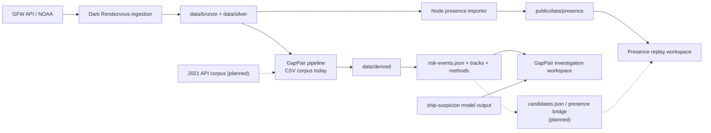

# Architecture

## Subsystem overview

Dark Rendezvous writes and retrieves the source material. The Node importer
independently turns GFW Presence reports into static replay assets. GapPair
processes the 2017–2019 CSV into a static 434-record screening export, which
drives the separate investigation workspace. The proposed 2021 loader and the
bridge from candidates into the presence replay are not implemented.

## Data contracts

| Presence contract | GapPair static candidate record | Future cross-corpus bridge |
| --- | --- | --- |
| Defined in [`code/backend/contracts/presence.ts`](../code/backend/contracts/presence.ts). `Observation` has `vesselId` as `gfw:<id>`, ISO UTC `ts`, separate numeric `lat` and `lon`, `presenceHours`, dataset version, and grid resolution. `catalog.json` declares coverage and daily shards; each day has observation and vessel-index URLs plus covered hours. | `pipeline/export.py` validates `risk-events.json`. A record has `id`, `tier`, `label`, `priority`, `riskScore`, two MMSI-keyed vessels, `window`, `meetingPoint`, bounded scores, score provenance, features, evidence, timeline, and embedded track GeoJSON. Coordinates use `[lon, lat]`; times are ISO-8601 UTC. | `candidates.json` is planned. Each candidate would add each vessel's `gfwId`, `presenceDays`, and `presenceCoverage`, then carry the candidate window, geometry, scores, evidence, and timeline into the replay. |
| Semantics: one hourly grid-cell-centre position per vessel-hour. It is not raw AIS. Coverage records queried hours, including covered-empty hours. Assets are daily, content-hashed static shards. | The static provider fetches the export directly; no runtime candidate API is required. The browser shows observed endpoints separately from estimated projections, meeting points, and reachable rings. | `presenceDays` covers the candidate window with adjacent UTC days. `presenceCoverage` would be `full`, `partial`, or `none` from the presence catalog. |

Two integration hazards are explicit:

- Identity key: GapPair starts with MMSI while the viewer selects `gfw:<vesselId>`. The 2017–2019 CSV corpus has no GFW IDs.
- Coordinate order: the presence contract exposes separate `lat`/`lon` fields; GapPair GeoJSON and MapLibre geometry use `[lon, lat]`.

## Observed vs estimated

Estimated geometry carries `observationStatus: "estimated"` and is never presented as an observed AIS position. GFW Presence grid centres are not raw AIS and are not rendezvous evidence. Observed endpoint features remain distinct from inferred projections, inferred meeting points, and reachable rings.

## Naming map

| Name | Meaning | Current state |
| --- | --- | --- |
| `wake.ai` | Product name. | Current product name. |
| Presence viewer / `Maritime Risk Intelligence` | Will's browser viewer and its current frontend brand string. | The string remains in the frontend and should be renamed later. |
| GapPair | Tanner's paired-dark-gap candidate pipeline. | The CSV reference path is materialized through S8 and feeds the investigation workspace; 2021 bridge and S9 remain missing. |
| Ship-suspicion model | Experimental individual-vessel model from Presence features. | Separate static top-200 snapshot; it does not alter the GapPair record or label. |
| Dark Rendezvous | Andrew's ingestion package and `dark-rendezvous` CLI. | Used for NOAA and GFW ingestion. |
| `Wake AI` | Slidev deck name. | Existing deck naming. |

## Ownership and independent operation

| Owner | Code and data boundary | Runs independently today |
| --- | --- | --- |
| Will Pallan (`gurubazawada`) | `code/frontend` and `code/backend` | Node builds GFW Presence assets; Vite serves the browser viewer. |
| Andrew Wang (`aywang71`) | `src/dark_rendezvous` and `scripts/*.ps1` | Python CLI ingests NOAA and retrieves GFW data. GFW access needs Andrew's token. |
| Tanner Shah (`tannershah`) | `pipeline`, `tests/test_pipeline_*`, `data/reference`, `data/derived` | Python stages process the CSV corpus and write derived artifacts. |

## Integration boundary

The static CSV-corpus integration is complete, but joining a candidate to the
Presence replay remains a separate task:

| Needed item | Status |
| --- | --- |
| S6 features, score, and S8 static export for the CSV reference corpus | Done: 434 validated records, 434 tracks, methods metadata, and evidence ledger. |
| Viewer investigation workspace, static candidate provider, and candidate geometry layers | Done for the CSV reference export. |
| 2021-corpus loader with GFW vessel IDs | Not started. |
| Bridge export that writes `candidates.json` | Not started. |
| GFW Presence pulled per candidate window | Not started. |

The 434 current records come from the CSV corpus and have no GFW vessel IDs;
the investigation workspace therefore does not claim to replay them as Presence
tracks. The original detailed prompts are retained in [archived handoff
prompts](archive/plan/handoff-prompts.md), section 14. See [data needs](data.md)
for the missing inputs.
